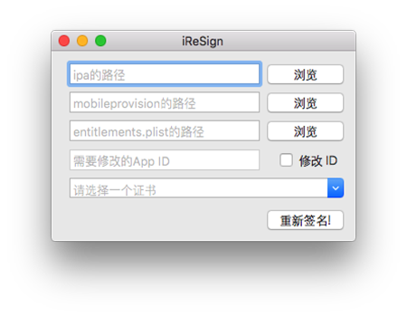

# GoodsInPrograming

## [FindProv.sh](./FindProv.sh) (iOS)

通过可读的`Provisioning Profile`名，在本地查找相应的`mobileprovision`文件。

用法: `./FindProv.sh 'MyDevelopProvisioning'`

## [iReSign](./iReSign)

重签名工具，工具作者是[iReSign](https://github.com/maciekish/iReSign)

**NOTE：** (2017年09月10日)测试时，第三栏`entitlements.plist`必须要设置。设置方法可以参考如下：

